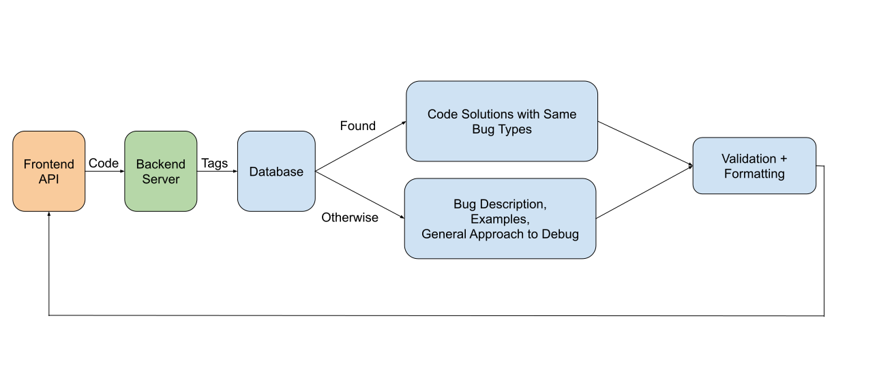

## LLAMA Co-Pilot -- CSCI2340

### Contributers
- Daniel Cho (daniel_s_cho@brown.edu)
- Xinye Yang (xinye_yang@brown.edu)
- Qiming Fang (qiming_fang@brown.edu)
- Yuming Xie (yuming_xie@brown.edu)
- Zhuoxuan Zhang (zhuoxuan_zhang@brown.edu)

#### Roles
- Frontend
    - Daniel Cho
    - Xinye Yang

- Backend
    - Qiming Fang
    - Yuming Xie
    - Zhuoxuan Zhang

### External Related Files

For assignments, presentation slides, old demos, and diagrams, we've made a google drive folder accessible [here](https://drive.google.com/drive/folders/1C3DmWq23ngmWKjMExT_AMkdETIPHeKNY?usp=sharing) for anyone interested.

### Repository Structure

This repository originally contained both the frontend and backend. However, because of the size of the backend, we've split the repository into the following frontend and backend components:
1. Frontend (This repository)
2. Backend server 1 ([link](https://github.com/rili0214/Code-Generating-Project))
3. Backend server 2 ([link](https://github.com/rili0214/Code-Debugging-Project))
4. Backend database ([link](https://github.com/rili0214/CGDP_DB))

The workflow of the backend is illustrated in the following figure.

The workflow for the backend database is illustrated in the following figure.

The final presentation is linked [here](https://docs.google.com/presentation/d/1am1Y3bHIITArzZwZaIg1M2pSemxAsT6AYTSwoL19fl4/edit?usp=sharing).

The final demo video is linked [here](https://drive.google.com/file/d/1hH6AFlCBuEU_5vhJvlM9MOyr58ST1I7c/view?usp=share_link).

There is an old version of the backend server in `archive/project_name` for those curious.

As for the structure of this repository, the files are organized as follows:
- archive--old files
- figures--images for the readme's
- resources--images used in the frontend application
- src--main files for the vscode extension
    - components--contains functions for the login and chat scripts
    - style--contains css styling for the frontend

#### Bugs

We've been attempting to get code highlighting in the outputs for the llm, however there's an issue in the parser where it cannot parse correctly when attempting to account for code highlighting. So for now, we've ommitted this functionality. 

### Quick Start

To run the vscode extension, do the following:
1. Clone the repository,
2. In the project root, run `npm install` and then `npm run compile`,
3. Open this repository in vscode and press `F5`. 
4. `crtl+shift+p` / `cmd+shift+p` / `F1`, and select `>Activate chatbox by login`, which will open the login page and prompt the user for a username and an api key. 
5. At this point, make sure that the backend is running to successfully login.
